# **论文阅读与前期工作总结**

* * *

### **姓名:** 黄世明、何思远、黄善恒

### **学号:** 17343047、17343038、17343046

* * *

## **前期工作**

* * *

### **使用示意图展示普通文件IO方式(fwrite等)的流程，即进程与系统内核，磁盘之间的数据交换如何进行？为什么写入完成后要调用fsync？**

* * *

对于普通文件IO方式的流程图，如下图所示，以read操作为例讲解进程与系统内核、磁盘之间的数据交换操作:
read系统调用在内核的处理，如上图所示， 经过了VFS、具体文件系统，如ext2、页高速缓冲存层、通用块层、IO调度层、设备驱动层、和设备层。其中，VFS主要是用来屏蔽下层具体文件系统操作的差异，对上提供一个统一接口，正是因为有了这个层次，所以可以把设备抽象成文件。具体文件系统，则定义了自己的块大小、操作集合等。引入cache层的目的，是为了提高IO效率。它缓存了磁盘上的部分数据，当请求到达时，如果在cache中存在该数据且是最新的，则直接将其传递给用户程序，免除了对底层磁盘的操作。通用块层的主要工作是，接收上层发出的磁盘请求，并最终发出IO请求（BIO）。IO调度层则试图根据设置好的调度算法对通用块层的bio请求合并和排序，回调驱动层提供的请求处理函数，以处理具体的IO请求。驱动层的驱动程序对应具体的物理设备，它从上层取出IO请求，并根据该IO请求中指定的信息，通过向具体块设备的设备控制器发送命令的方式，来操纵设备传输数据；
由于Cache层的存在， 因此需要**使用fsync函数同部内存中所有已修改的文件数据到储存设备中。**

### **简述文件映射的方式如何操作文件。与普通IO区别？为什么写入完成后要调用msync？文件内容什么时候被载入内存**

文件映射方式即内存映射文件，是由一个文件到一块内存的映射。Win32提供了允许应用程序把文件映射到一个进程的函数 。内存映射文件与虚拟内存有些类似，通过内存映射文件可以保留一个地址空间的区域，同时将物理存储器提交给此区域，内存文件映射的物理存储器来自一个已经存在于磁盘上的文件，而且在对该文件进行操作之前必须首先对文件进行映射。
使用普通IO方式时，当需要处理存储与磁盘上的文件时，需要对文件执行I/O操作，而内存映射文件通过文件映射这种使磁盘文件的全部或部分内容与进程虚拟地址空间的某个区域建立映射关联的能力，**可以直接对被映射的文件进行访问，而不必执行文件I/O操作也无需对文件内容进行缓冲处理。** 
进程在映射空间的对共享内容的改变并不直接写回到磁盘文件中，可以通过**调用msync()函数来实现磁盘文件内容与共享内存区中的内容一致,即同步操作。**

### **参考[Intel的NVM模拟教程](https://software.intel.com/zh-cn/articles/how-to-emulate-persistent-memory-on-an-intel-architecture-server)模拟NVM环境，用fio等工具测试模拟NVM的性能并与磁盘对比（关键步骤结果截图）。**

在设置好NVM模拟环境后，进行了四种测试，如下(注：磁盘的吞吐量bw，这个是顺序读写考察的重点；磁盘的每秒读写次数iops，这个是随机读写考察的重点，测试中sda5代表磁盘，pmem0m代表NVM，测试命令模板为：fio --filename=/root/test -iodepth=64 -ioengine=libaio --direct=1 --rw=read --bs=1m --size=2g --numjobs=4 --runtime=10 --group_reporting --name=test-read;其中filename=/root/test 测试文件名称，通常选择需要测试的盘的data目录。 direct=1测试过程绕过机器自带的buffer，使测试结果更真实。 rw=randwrite测试随机写的I/O，rw=randrw 测试随机写和读的I/O；bs=4k 单次io的块文件大小为4k；size=2g 本次的测试文件大小为2g，以每次4k的io进行测试； numjobs=64本次的测试线程为64.；runtime=20 测试时间为20秒，如果不写则一直将2g文件分4k每次写完为止)：

1.进行顺序读的测试，结果如图：
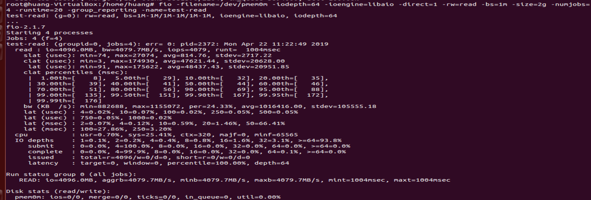
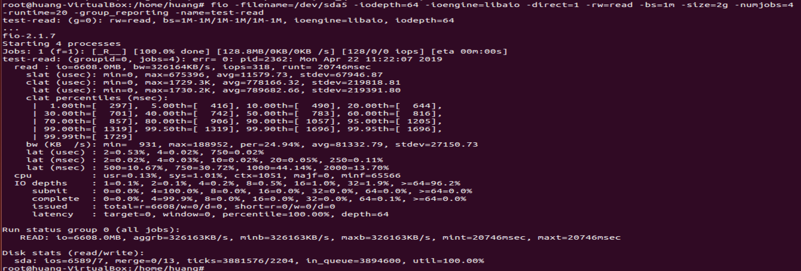
从图可知NVM的吞吐量大约为4879MB/s，而磁盘的大约为32MB/s，NVM读取速度是磁盘的百倍。

2.进行顺序写的测试，结果如图：
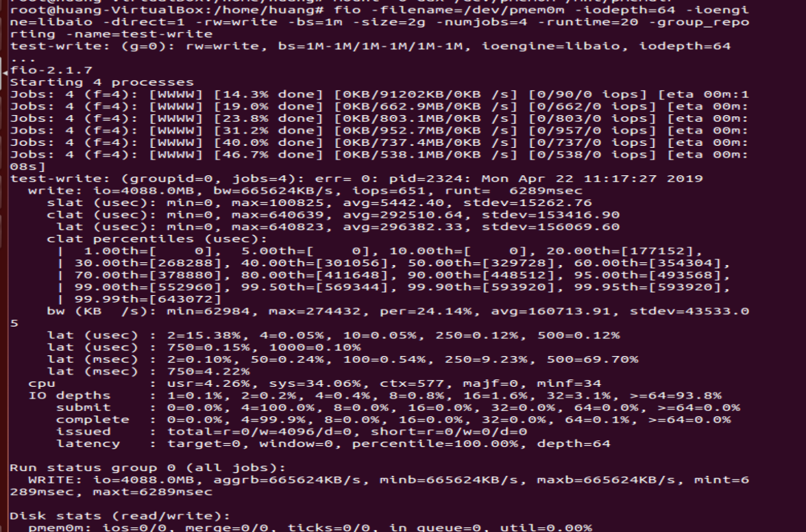
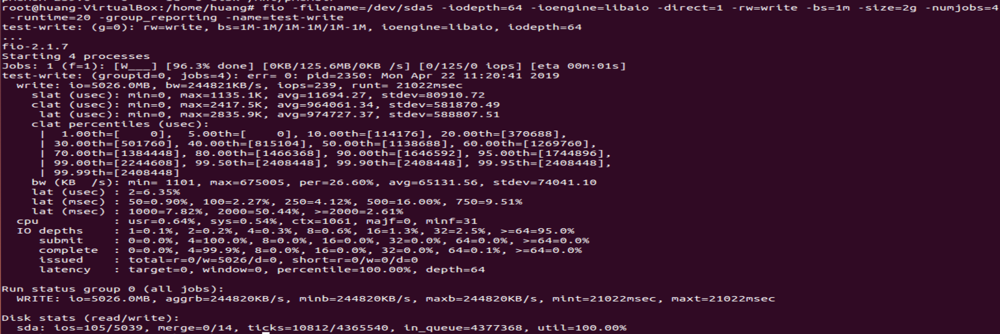
从图可知NVM的吞吐量大约为66MB/s，而磁盘的大约为22MB/s，NVM写的速度只是磁盘的俩三倍。

3.进行随机读的测试，结果如下：
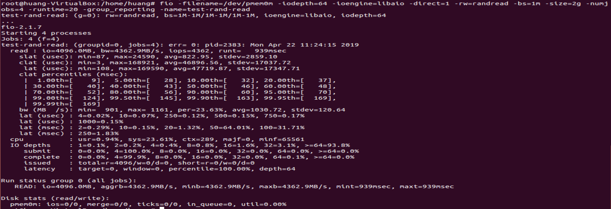
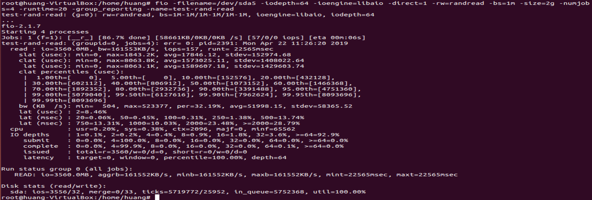
从图可知NVM的每秒读次数大约为4362，而磁盘的大约为157，NVM读的速度只是磁盘的几十倍。

4.进行随机写的测试，结果如下：
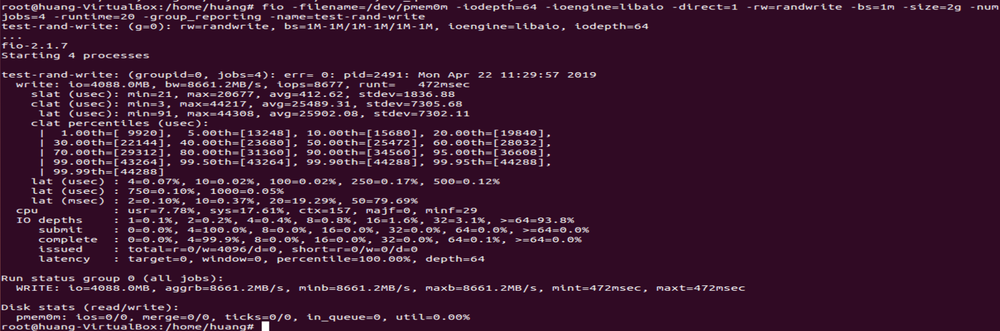
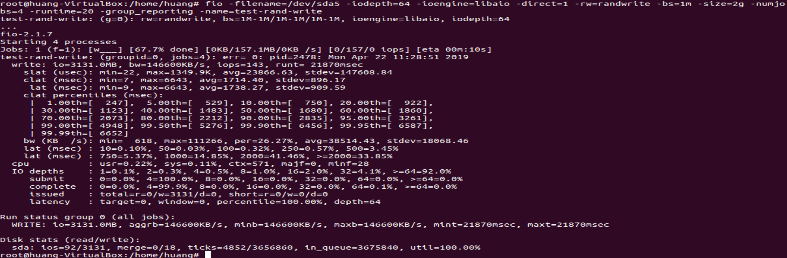
从图可知NVM的每秒读次数大约为8677，而磁盘的大约为143，NVM读的速度只是磁盘的几十倍。
综上，可知NVM的性能在顺序读和随机读写方面比磁盘强很多，而顺序写则和磁盘差距不是很大，但仍有优势。

### **使用[PMDK的libpmem库](http://pmem.io/pmdk/libpmem/)编写样例程序操作模拟NVM（关键实验结果截图，附上编译命令和简单样例程序）。**

首先需要安装PMDK库，这需要如下的步骤：

**1.安装依赖包：**

- **autoconf**
- **pkg-config**
- **libndctl-devel** 
- **libdaxctl-devel**
  部分过程如下：
  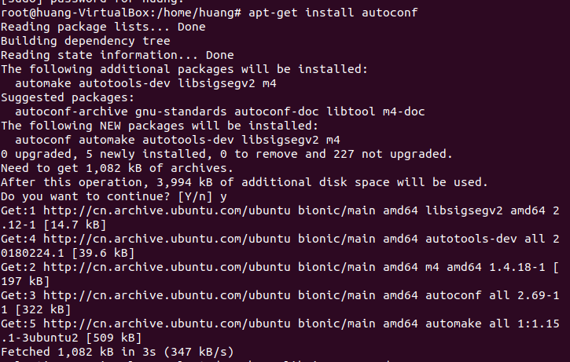
  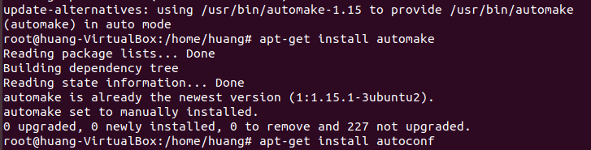
  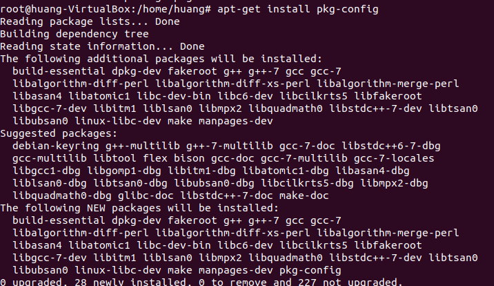
  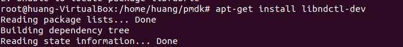
  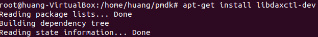
  
  **2.在Linux上构建PMDK：**
  
  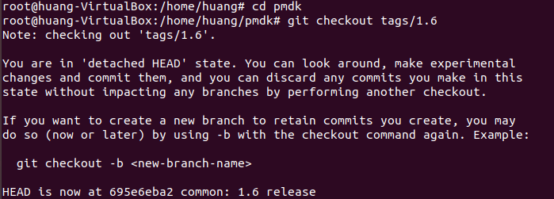
  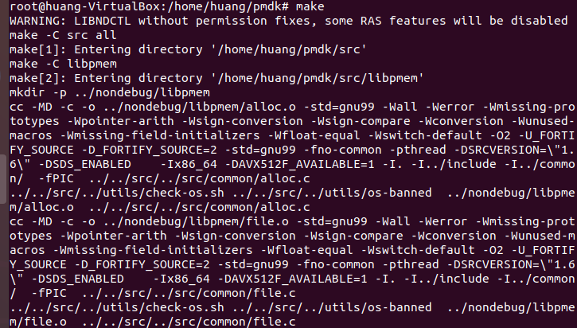
  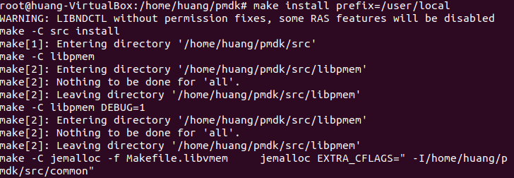
  安装完成之后，执行样例程序，修改了写出文件：
  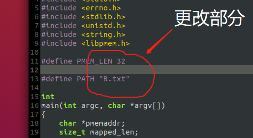
  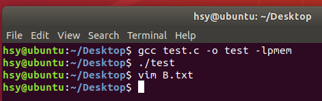
  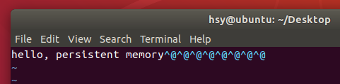

* * *

## **论文阅读**

* * *

### **总结一下本文的主要贡献和观点(500字以内)(不能翻译摘要)**

论文基于存储类内存SCM的出现研究设计持久树以支持内存和存储合并的单层体系结构。这种单层体系结构的设计使得原有的内存B树不再适用，因此本文提出一种新的b树：树的叶子节点保存在SCM中，内部节点放置在DRAM中，而DRAM部分的内容允许在恢复后重建，这种树命名为指纹识别树FPTree。
FPTree中，采用一个字节散列作为叶键即指纹，通过在搜索过程中首先扫描指纹，使得指纹作为过滤器大幅度提高FPTree性能。
给出FPTree的相应实现方法后，基于现存的两种最先进的持久性树nv、wBTree，使用微基准测试测试FPTree，并与上述树的性能进行对比。结果发现，FPTree性能优于这两种最先进的持久性树，即便是受延迟影响下，性能也接近于基于DRAM的树。而基于FPTree对数据的处理方式，实现了性能接近于基于DRAM树且受延迟影响小的持久树。
总的来说，该论文提出并设计了FPTree（fingerprintTree），一种混合SCM-DRAM持久和并发的B+树，性能接近于DRAM的同时实现了内存的非易失性。

### **SCM硬件有什么特性？与普通磁盘有什么区别？普通数据库以页的粒度读写磁盘的方式适合操作SCM吗？**

**特性**：SCM结合了传统存储介质的经济特性、容量和非易失性，具有DRAM的低延迟和字节寻址能力、延迟较慢且不对称，写操作明显慢于读操作。
**区别**：SCM硬件相较于普通磁盘而言访问更加快速，但写次数有限，写次数过多可能造成永久失效的问题。
适合；上述所说与普通磁盘的区别说明需要使用细粒度来处理SCM硬件可以避免发生内存泄漏等问题，使用页粒度还可以解决SCM所需的HTM和持久性原语的不兼容性。

### **操作SCM为什么要调用CLFLUSH等指令？**

SCM是通过一个长波动链访问的，该波动链包括存储缓冲区、CPU缓存和内存控制器缓冲区，对于所有这些缓冲区，**软件几乎没有控制权**。建议使用SCMaware**文件系统来管理**SCM，该系统允许应用程序层直接访问带有mmap的SCM，从而支持加载/存储语义。因此，如果没有软件的努力，就不能保证SCM写的顺序和持久性。为了解决这个问题，我们使用了与现有技术类似的持久性原语，即CLFLUSH、MFENCE、SFENCE和非时态写。**即如文件系统这种软件通过调用CLFLUSH等函数强制SCM硬件执行操作**。CLFLUSH从缓存中删除缓存行并将其内容写回内存。 如果写入后不调用CLFLUSH指令，发生系统崩溃后会丢失数据。

### **FPTree的指纹技术有什么重要作用？**

提高性能。在SCM中，未排序的叶子需要昂贵的线性扫描，而使用指纹识别的技术可以提高性能。指纹是叶键的一个字节散列，在叶键的开头连续存储。通过在搜索过程中首先扫描指纹，指纹可以作为过滤器，避免探测到指纹与搜索键不匹配的密钥。

### **为了保证指纹技术的数学证明成立，哈希函数应如何选取？**

指纹识别技术的目的是让叶内键探针的期望数量等于1，因此哈希函数需要满足：
假设一个生成均匀分布指纹的哈希函数，其中设m为叶子中的条目数，n为可能的哈希值（对于单字节指纹，n=256）。
P[K = i]为搜索指纹至少出现一次且恰好有i出现的概率：
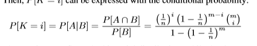
计算一个指纹在叶子中出现的期望次数，记为E[K]，它等于指纹数组中哈希冲突的次数加1：
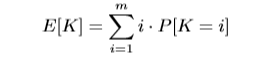
通过已知指纹命中的期望次数，我们可以确定叶内键探针的期望数目，记为[T]，即在线性搜索长度为E[K]的键上，按指纹命中所表示的键的期望数目:
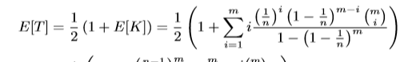
**选取的哈希函数的哈希值需要满足以上三条等式。**

### **持久化指针的作用是什么？与课上学到的什么类似？**

当程序重新启动时，程序会以一个新的地址速度执行操作，这会使所有存储的虚拟指针无效。因此，需要一种机制，允许在重新启动时恢复SCM中的数据。此时使用包含8字节文件ID和8字节偏移量的**持久指针可以实现恢复SCM中数据**。文件ID对应于由持久性分配器创建并用作分配内存数据的文件。持久分配器提供持久指针和易失性指针之间的双向转换。由于持久指针在失败时仍然有效，所以它们用于在重启时刷新易失性指针。**即持久化指针可以保证任何点的崩溃恢复到一致的状态，不会丢失信息。** 这与课上学到的记录用户请求和维护数据库所有变化的**日志**类似。
